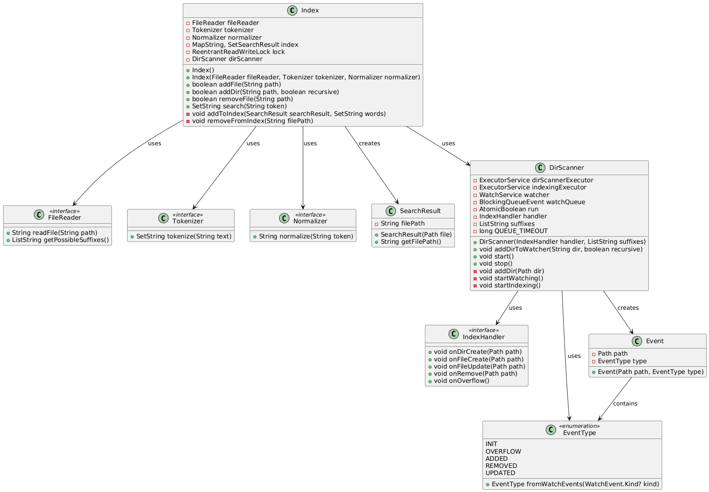

# Диаграмма классов



# Настройка окружения

## 1. Установка JDK 21

Проверка установленного окружения:
```bash
java -version
```

# Сборка проекта

## Скомпилировать проект
```bash
./gradlew build
```

## Собрать без тестов
```bash
./gradlew build -x test
```

# Запуск приложения

## Запуск через Gradle
```bash
./gradlew run
```

# Запуск тестов

## Запустить все тесты
```bash
./gradlew test
```